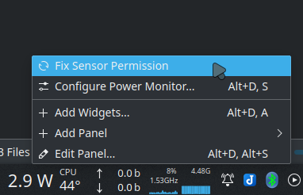

# Power Monitor
Another stupidly simple KDE Plasma 5 widget to monitor the power consumption of your CPU (only) in real time.

This is a fork of [Power Monitor](https://github.com/atul-g/plasma-power-monitor). The original measures the battery power consumption while this extension measures only <b>Intel</b> CPU's power.

## Preview
Widget shown on desktop

Widget shown on taskbar

## Installation

To install this, right click on the desktop, click on `Add Widgets`, select `Get New Widgets`, select `Download New Plasma Widgets` and search for `CPU Power Monitor`. Install it by pressing the install button.

## Customization
As of now there are only two configuration settings; To make the text bold and to alter the update interval of the widgets:  

### Note
1. The widget displays power consumption in Watts.
2. This widget makes use of the `/sys/class/powercap/intel-rapl:0/energy_uj` file to query the energy consumption. If the widget displays "0.0 W", then you either 
    * don't have this file in your Linux Distribution, or
    * don't have the permission to read the said file.
3. If later is the case, try:
    * select `Fix Sensor Permission` in the right click menu as seen below and enter your Super User password
    
    
    
    
    
    * running `sudo chmod 444 /sys/class/powercap/intel-rapl:0/energy_uj` in konsole and see if the issue is fixed.
4. The power usage rises continously when the laptop is plugged in to A/C power. It is normal if you see high readings.
5. This will only work for <b>Intel CPUs</b>.
